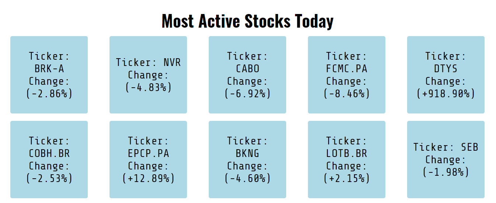

The Exchange Price

Live Site- https://jax2220.github.io/TheExchangePrice/

Screen Shots of app-

Summary-
	ExchangePrice is an app that lets you search the U.S stock market for stock prices by ticker symbol as well as giving you the name of the company and a description.  You can also see what the most active stocks are at the moment. 

Technologies used for this project-
	HTML/CSS/JavaScript/jQuery/Json/git

